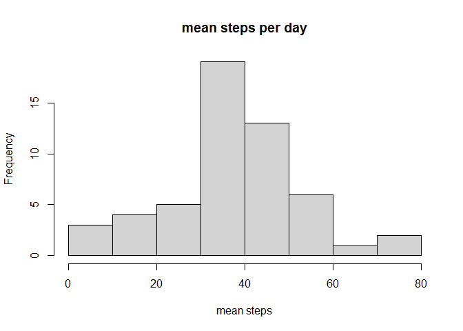
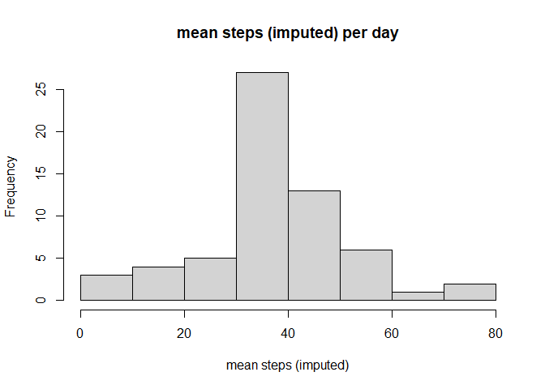
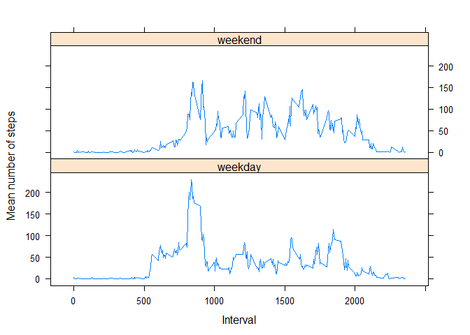

## Loading and preprocessing the data


```r
fileURL = "https://d396qusza40orc.cloudfront.net/repdata%2Fdata%2Factivity.zip"
destfile = "activity.zip"
if(!file.exists("activity.csv")) {
  download.file(fileURL, destfile)
  unzip(destfile)
}
activity <- read.csv(file="activity.csv")
activity_valid <- na.omit(activity)
```

## What is the mean and median total number of steps taken per day?


```r
library(dplyr)
```

```
## 
## Attaching package: 'dplyr'
```

```
## The following objects are masked from 'package:stats':
## 
##     filter, lag
```

```
## The following objects are masked from 'package:base':
## 
##     intersect, setdiff, setequal, union
```

```r
steps <- activity_valid %>% group_by(date) %>% summarize(mean_steps = mean(steps), median_steps = median(steps))
hist(steps$mean_steps, main="mean steps per day", xlab="mean steps")
```

<!-- -->

```r
print(steps, n=nrow(steps))
```

```
## # A tibble: 53 x 3
##    date       mean_steps median_steps
##    <chr>           <dbl>        <dbl>
##  1 2012-10-02      0.438            0
##  2 2012-10-03     39.4              0
##  3 2012-10-04     42.1              0
##  4 2012-10-05     46.2              0
##  5 2012-10-06     53.5              0
##  6 2012-10-07     38.2              0
##  7 2012-10-09     44.5              0
##  8 2012-10-10     34.4              0
##  9 2012-10-11     35.8              0
## 10 2012-10-12     60.4              0
## 11 2012-10-13     43.1              0
## 12 2012-10-14     52.4              0
## 13 2012-10-15     35.2              0
## 14 2012-10-16     52.4              0
## 15 2012-10-17     46.7              0
## 16 2012-10-18     34.9              0
## 17 2012-10-19     41.1              0
## 18 2012-10-20     36.1              0
## 19 2012-10-21     30.6              0
## 20 2012-10-22     46.7              0
## 21 2012-10-23     31.0              0
## 22 2012-10-24     29.0              0
## 23 2012-10-25      8.65             0
## 24 2012-10-26     23.5              0
## 25 2012-10-27     35.1              0
## 26 2012-10-28     39.8              0
## 27 2012-10-29     17.4              0
## 28 2012-10-30     34.1              0
## 29 2012-10-31     53.5              0
## 30 2012-11-02     36.8              0
## 31 2012-11-03     36.7              0
## 32 2012-11-05     36.2              0
## 33 2012-11-06     28.9              0
## 34 2012-11-07     44.7              0
## 35 2012-11-08     11.2              0
## 36 2012-11-11     43.8              0
## 37 2012-11-12     37.4              0
## 38 2012-11-13     25.5              0
## 39 2012-11-15      0.142            0
## 40 2012-11-16     18.9              0
## 41 2012-11-17     49.8              0
## 42 2012-11-18     52.5              0
## 43 2012-11-19     30.7              0
## 44 2012-11-20     15.5              0
## 45 2012-11-21     44.4              0
## 46 2012-11-22     70.9              0
## 47 2012-11-23     73.6              0
## 48 2012-11-24     50.3              0
## 49 2012-11-25     41.1              0
## 50 2012-11-26     38.8              0
## 51 2012-11-27     47.4              0
## 52 2012-11-28     35.4              0
## 53 2012-11-29     24.5              0
```

## What is the average daily activity pattern?


```r
intervals <- activity_valid %>% group_by(interval) %>% summarize(mean_steps = mean(steps))
with(intervals, plot(interval, mean_steps, type="l"))
```

<!-- -->

```r
paste("Time interval with maximum mean steps is",intervals$interval[which(intervals$mean_steps == max(intervals$mean_steps))])
```

```
## [1] "Time interval with maximum mean steps is 835"
```

## Imputing missing values

Check if any dates or intervals are missing and issue a warning if true.  
Missing step values will be imputed from the mean value for that time interval.  
Mean and median total steps per day (with missing values imputed) will be presented.


```r
if (!anyNA(activity$date)) {
  print("No missing date values")
} else {
    print("Missing dates - use caution")
}
```

```
## [1] "No missing date values"
```

```r
if (!anyNA(activity$interval)) {
  print("No missing interval values")
} else {
  print("Missing intervals - use caution")
}
```

```
## [1] "No missing interval values"
```

```r
activity_NA <- is.na(activity$steps)
paste("Number of missing rows is",sum(activity_NA))
```

```
## [1] "Number of missing rows is 2304"
```

```r
activity_imputed <- activity
for (i in 1:length(activity_imputed$steps)) {
  if (activity_NA[i] == TRUE) {
    activity_imputed$steps[i] <- intervals$mean_steps[which(intervals$interval == activity_imputed$interval[i])] }
}

steps_i <- activity_imputed %>% group_by(date) %>% summarize(mean_steps = mean(steps), median_steps = median(steps))
hist(steps_i$mean_steps, main="mean steps (imputed) per day", xlab="mean steps (imputed)")
```

<!-- -->

```r
print(steps_i, n=nrow(steps_i))
```

```
## # A tibble: 61 x 3
##    date       mean_steps median_steps
##    <chr>           <dbl>        <dbl>
##  1 2012-10-01     37.4           34.1
##  2 2012-10-02      0.438          0  
##  3 2012-10-03     39.4            0  
##  4 2012-10-04     42.1            0  
##  5 2012-10-05     46.2            0  
##  6 2012-10-06     53.5            0  
##  7 2012-10-07     38.2            0  
##  8 2012-10-08     37.4           34.1
##  9 2012-10-09     44.5            0  
## 10 2012-10-10     34.4            0  
## 11 2012-10-11     35.8            0  
## 12 2012-10-12     60.4            0  
## 13 2012-10-13     43.1            0  
## 14 2012-10-14     52.4            0  
## 15 2012-10-15     35.2            0  
## 16 2012-10-16     52.4            0  
## 17 2012-10-17     46.7            0  
## 18 2012-10-18     34.9            0  
## 19 2012-10-19     41.1            0  
## 20 2012-10-20     36.1            0  
## 21 2012-10-21     30.6            0  
## 22 2012-10-22     46.7            0  
## 23 2012-10-23     31.0            0  
## 24 2012-10-24     29.0            0  
## 25 2012-10-25      8.65           0  
## 26 2012-10-26     23.5            0  
## 27 2012-10-27     35.1            0  
## 28 2012-10-28     39.8            0  
## 29 2012-10-29     17.4            0  
## 30 2012-10-30     34.1            0  
## 31 2012-10-31     53.5            0  
## 32 2012-11-01     37.4           34.1
## 33 2012-11-02     36.8            0  
## 34 2012-11-03     36.7            0  
## 35 2012-11-04     37.4           34.1
## 36 2012-11-05     36.2            0  
## 37 2012-11-06     28.9            0  
## 38 2012-11-07     44.7            0  
## 39 2012-11-08     11.2            0  
## 40 2012-11-09     37.4           34.1
## 41 2012-11-10     37.4           34.1
## 42 2012-11-11     43.8            0  
## 43 2012-11-12     37.4            0  
## 44 2012-11-13     25.5            0  
## 45 2012-11-14     37.4           34.1
## 46 2012-11-15      0.142          0  
## 47 2012-11-16     18.9            0  
## 48 2012-11-17     49.8            0  
## 49 2012-11-18     52.5            0  
## 50 2012-11-19     30.7            0  
## 51 2012-11-20     15.5            0  
## 52 2012-11-21     44.4            0  
## 53 2012-11-22     70.9            0  
## 54 2012-11-23     73.6            0  
## 55 2012-11-24     50.3            0  
## 56 2012-11-25     41.1            0  
## 57 2012-11-26     38.8            0  
## 58 2012-11-27     47.4            0  
## 59 2012-11-28     35.4            0  
## 60 2012-11-29     24.5            0  
## 61 2012-11-30     37.4           34.1
```

Additional analysis: what is the average daily activity pattern when including the imputed data?


```r
intervals_i <- activity_imputed %>% group_by(interval) %>% summarize(mean_steps = mean(steps))
with(intervals_i, plot(interval, mean_steps, type="l"))
```

<!-- -->

```r
paste("Time interval with maximum mean steps (imputed) is",intervals_i$interval[which(intervals_i$mean_steps == max(intervals_i$mean_steps))])
```

```
## [1] "Time interval with maximum mean steps (imputed) is 835"
```

## Are there differences in activity patterns between weekdays and weekends?


```r
activity_imputed_dt <- activity_imputed
activity_imputed_dt$day_type <- NULL
for (d in 1:length(activity_imputed_dt$date)) {
  if (weekdays(as.Date(activity_imputed_dt$date[d])) %in% c("Monday","Tuesday","Wednesday","Thursday","Friday")) {
    activity_imputed_dt$day_type[d] <- "weekday"
  } else {
    activity_imputed_dt$day_type[d] <- "weekend"
    }
}

library(lattice)
intervals_dt <- activity_imputed_dt %>% group_by(day_type, interval) %>% summarize(mean_steps = mean(steps))
xyplot(mean_steps ~ interval | day_type, intervals_dt, type="l", layout=c(1,2), ylab="Mean number of steps",xlab="Interval")
```

<!-- -->
